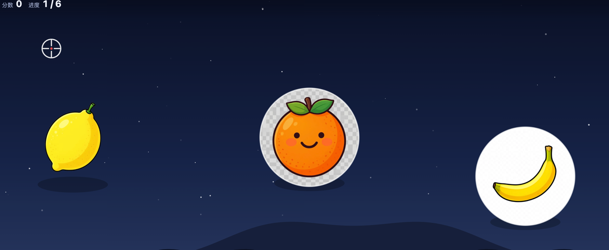

# 单词射击 (word-shooter)

给孩子练英语单词的射击类网页游戏:**听到单词的发音 → 瞄准对应的图片开枪**。打中有爆炸和连击,打错会红闪并自动重播语音,让他改对为止。



Vite + TypeScript + Canvas 2D 写的前端,Go 单二进制托管,局域网/公网都能开。词库的图片和发音既可以自己丢文件,也可以在后台用 OpenRouter 一键生成。

## 快速开始

需要 Go 1.22+ 和 Node 18+。

```bash
./build.sh            # 构建前端 + 打包成单二进制
./build/word-shooter  # 启动,默认 :8091
```

启动日志里会打印局域网地址,直接在孩子的平板上打开就能玩。

**没有素材也能立刻开玩** —— 素材目录为空时前端会退回内置的 emoji 占位词库(24 个词,用浏览器 TTS 发音)。图和音频到位后自动切换成你的。

---

## 后台管理页 `/admin`

登录后能管理类别和词条,并且**直接用 OpenRouter 生成图片和发音**。账号密码取自二进制同目录的 `.env`(照着 [`.env.example`](.env.example) 复制一份):

```
admin=你的用户名
password=你的密码
OPENROUTER_API_KEY=sk-or-...
AZURE_API_KEY=...              # 可选,发音的第二个来源
```

`admin` 和 `password` 少一个,整个后台就自动禁用并在启动日志里说明 —— 免得部署到公网上门户大开。两个 API key 只影响 AI 生成:没配也能进后台管词条,只是不显示对应的生成按钮。

| 页面 | 能做什么 |
| --- | --- |
| **词条** | 卡片列出所有词,标出缺图/缺音的;点开可改中文、换类别、删除(连文件一起删);发音可以在两个语音源之间来回试 |
| **类别** | 增删改排序。类别决定游戏分成哪几关,改了名字游戏选关页跟着变 |
| **批量生成** | 粘一列单词(`apple 苹果` 这种带中文也行),串行生成图+音,预览后一次性保存 |
| **设置** | 图片模型、尺寸、prompt 模板;默认语音源、两个源各自的音色、语速;「试生成一张」「试听 Azure / OpenRouter」 |

**生成的东西不会立刻落盘** —— 先在页面上预览(图看得到、音听得到),点保存才写进 `assets`。重生成多少次都不会留垃圾文件,每次也会显示 OpenRouter 报的实际花费。

### 选模型:透明底 vs 便宜快

图片模型基本要在这两头之间选一个:

| 模型 | 透明底 | 价格/张 | 说明 |
| --- | --- | --- | --- |
| `sourceful/riverflow-v2.5-fast`(默认) | 否,只出 jpeg | $0.019 | 快、便宜 |
| `sourceful/riverflow-v2.5-pro` | 是,png/webp | $0.13 | 质量最好,但明显更慢,贵 7 倍 |
| `openai/gpt-image-1-mini` 等 | 是 | 按 token 计 | 部分账号会被 provider 以 403 ToS 拒掉 |

默认取 fast —— 给孩子加词动辄几十上百张,贵 7 倍不划算。

**不透明也不难看**:`AssetLoader` 加载时会采样图片四角,发现没抠过背景就自动裁成圆形靶子,真透明图则原样使用。上面截图里带白圈的橙子和香蕉就是裁出来的,柠檬是真透明图。

设置页的模型下拉会把真正支持透明底的用 `✓` 标出来并排在最前面。判断依据是 `background` 和 `output_format` 两个字段一起看 —— fast 虽然声明支持 `transparent`,但它只出 jpeg,而 **jpeg 和透明底不能共存**(Sourceful 会直接回 422),所以不算数。

生成一张图通常要十几到几十秒,后台按钮上会实时跳秒数,服务端日志也会打印耗时和实际花费。批量生成是串行的,10 个词就是 10 倍时间。

### 发音:两个语音源并存

| 源 | 默认音色 | 说明 |
| --- | --- | --- |
| **Azure 语音**(默认) | `en-US-AnaNeural` | 微软的**儿童音色**,音质稳。按字符计费,单次不报价 |
| **OpenRouter** | `hexgrad/kokoro-82m` + `af_bella` | 温和的美音女声,便宜 |

两个源**同时保留**,互不覆盖:

- **词条编辑页**语音那栏有两个按钮(`✨ Azure` / `✨ OpenRouter`),想听哪个点哪个,反复换着生成直到满意再保存,预览下面会标出当前听的是哪个源
- **设置页**选默认源,批量生成走它;两边的音色分开存(`azureVoice` / `ttsVoice`),来回切不会互相冲掉。设置页还有「试听 Azure」「试听 OpenRouter」两个按钮,用下拉里当前选的音色直接出声,不用先保存
- **批量页**可以本次单独指定源,也可以「跟随设置」

Azure 出来的是 24kHz 单声道 48kbps mp3,一个单词约 10KB / 1.8 秒;OpenRouter 约 6KB / 1.4 秒。两边都受设置里的「语速」控制(Azure 转成 SSML 的 `prosody rate` 百分比)。

**Azure 的区域**:端点是按区域走的,区域不对一律 401。默认 `eastasia`,要改就在 `.env` 里加 `AZURE_SPEECH_REGION=你的区域`。

想换模型/音色也可以直接写 `.env`,不用进后台:

```
OPENROUTER_IMAGE_MODEL=...
OPENROUTER_TTS_MODEL=...
OPENROUTER_TTS_VOICE=...
AZURE_SPEECH_REGION=eastasia
AZURE_TTS_VOICE=en-US-AnaNeural
TTS_PROVIDER=azure           # azure | openrouter
```

---

## 加词:丢两个文件就行

(不想用后台的话,手动丢文件的方式一直有效)

后端每次请求 `/api/words/manifest` 都会重扫素材目录,把 `images/` 和 `audio/` 里**文件名相同**的配成一个词。加词不需要改代码,刷新页面即可:

```
assets/
├── images/apple.webp     ┐ 文件名要一致
├── audio/apple.mp3       ┘
├── sfx/hit.mp3           # 可选音效,没有就用代码合成的
└── words.json            # 可选,补中文释义和分类
```

文件名就是单词本身,小写,词组用连字符:`ice-cream.webp` / `ice-cream.mp3`。
只有图或只有音频的会被跳过,并在启动日志里提示缺哪个。

`assets/words.json` 存中文释义和类别,不写也能跑(释义留空、全部归到「综合」关):

```json
{
  "categories": [
    { "id": "fruit", "name": "水果", "icon": "🍎", "order": 1 }
  ],
  "words": {
    "apple": { "zh": "苹果", "tags": ["fruit"] },
    "cat":   { "zh": "猫",   "tags": ["animal"] }
  }
}
```

后台会写成这个格式。**早期那种顶层直接是 `{ "apple": {...} }` 的扁平写法仍然能读**,只是没有类别名和图标,游戏会退回内置的中文对照表。

`tags` 的第一个决定这个词进哪一关。**同一个 tag 攒够 3 个词才会自动成一关**(1 个正确答案 + 至少 2 个干扰项),不够的会并进「综合」关;词总数够 8 个还会再组一关「混合挑战」。已内置的分类名:`fruit animal school food body color number family clothes vehicle`,写别的 tag 也行,关卡名就直接显示这个 tag。

### 素材格式

| | 推荐 | 说明 |
| --- | --- | --- |
| 图片 | **WebP 有损 q80,带透明通道,512×512** | 抠掉背景最好,直接就能当靶子;没抠也行,会被自动裁成圆形。体积约为 PNG 的 1/4,控制在 50KB 以内。也支持 png/svg/jpg/gif |
| 音频 | **MP3,64–128kbps 单声道,1~2 秒** | 前后不要留静音,不然按下去感觉半天不出声。也支持 m4a/aac/ogg/wav |

批量转 WebP:

```bash
for f in *.png; do cwebp -q 80 -alpha_q 100 "$f" -o "${f%.png}.webp"; done
```

---

## 玩法

一轮:靶子飞入 → 播单词发音 → 瞄准开枪。

- 打中:爆炸 + 单词和中文浮出 + 连击 +1,反应越快加分越多
- 打错:红闪抖动 + 扣分 + **自动重播发音**,这一轮不结束
- 一关最多 10 轮(词不够就有几个词打几轮,混合挑战 12 轮),结算页给命中率、最佳连击、平均反应时间和错词回顾
- 最高分存在浏览器 localStorage 里

键盘:`空格` 重听发音,`Esc` 退出这一关。触屏直接点,iPad 可玩。

难度调整全在 [balance.ts](web/src/config/balance.ts):判定半径、漂浮速度、分数、反馈时长。判定半径默认比视觉半径大 15%,擦边也算中 —— 给孩子放宽的。

---

## 开发

```bash
cd web && npm install && npm run dev   # 前端 :5181,/api 和 /assets 代理到 :8091
go run . -assets ./assets              # 后端 :8091
```

后端不起也能开发,前端会自动用内置占位词库。

dev 模式下控制台有 `__game` 可以调试,`__game.debugTargets()` 会列出当前回合的靶子位置和哪个是正确答案。

### 目录

```
main.go        静态服务 + 路由 + dotfile 防护
manifest.go    扫描素材生成词库,读写 words.json
admin.go       后台 API(类别/词条 CRUD、生成、设置)
auth.go        无数据库的 session 鉴权 + 登录限流
openrouter.go  图片和 OpenRouter 语音,按模型支持的参数构造请求
azure.go       Azure 语音(SSML 合成 + 英语音色列表)
tts.go         两个语音源的分发
settings.go    assets/settings.json 读写
env.go         .env 加载

web/admin.html + web/src/admin/    后台页面(Vite 第二个入口)
web/src/
├── core/Game.ts          画布、dpr 适配、主循环、流程编排
├── scenes/PlayScene.ts   一轮的状态机:spawning → listening → feedback
├── systems/              AssetLoader(图) AudioManager(声) Progress(存档)
├── entities/             Target Particle Crosshair
├── render/Background.ts  夜空 + 星星 + 远山
├── ui/                   HUD 和 覆盖层(菜单/加载/结算),这几个是 DOM 不是 canvas
└── config/               levels.ts(按 tag 切关) balance.ts(手感)
```

几个绕不开的坑,已经处理过了:

1. **iOS 音频解锁** —— `AudioContext` 必须在点击的同步调用栈里 resume 并播一个静音 buffer,否则 iPad 上全程没声音。见 `AudioManager.unlock()`。
2. **前端产物不能放 `/assets/`** —— 那条路由被素材目录占了。`vite.config.ts` 里把 `assetsDir` 改成了 `static`。
3. **主循环不能在末尾排下一帧** —— `Game.frame()` 里 `requestAnimationFrame` 必须放在开头并包 try/catch。放末尾的话,通关那一帧 `this.play` 被置空引发的空指针会直接掐断整条 rAF 链,画面永久冻住。
4. **OpenRouter 图片参数要照着模型能力拼** —— 每个模型只接受自己声明的参数,取值还必须落在它的 enum 白名单里;多发一个字段、或者值不在白名单里,都是 400。`generateImage()` 会先查 `/images/models` 的 `supported_parameters` 再拼请求。两个具体的坑:`supported_parameters` 已经从字符串数组改成了对象(`{"output_format":{"type":"enum","values":["jpeg"]}}`),`parseModelCaps()` 两种格式都认;`jpeg` 配 `background: transparent` 会被 provider 以 422 拒掉,这个组合在代码里被挡住了。
5. **词 id 必须过白名单正则** —— 后台能写文件,没有这道防线的话 id 传 `../../.env` 就能覆盖密钥。

---

## 部署

前端已经 `go:embed` 进二进制,**assets 目录不打包** —— 放二进制同目录即可(也能用 `-assets` 指定别的路径)。纯静态无 CGO,服务器上不需要装 Go、Node 或任何运行时。

### 自动:push 到 main 就出包

[`.github/workflows/build.yml`](.github/workflows/build.yml) 会在每次 push 到 `main` 时构建前端、交叉编译 linux/amd64 和 linux/arm64,然后覆盖名为 `latest` 的 Release。下载地址是固定的,不用管版本号:

```
https://github.com/kongchujun/word-shooter/releases/download/latest/word-shooter-linux-amd64
```

服务器上第一次准备:

```bash
mkdir -p /opt/word-shooter && cd /opt/word-shooter
curl -fSLO https://raw.githubusercontent.com/kongchujun/word-shooter/main/deploy.sh
chmod +x deploy.sh
# 再从本机把 .env 和 assets/ 传上来(这两样都不在仓库里)
```

之后每次更新只要一条命令:

```bash
./deploy.sh              # 默认端口 8091
PORT=9000 ./deploy.sh    # 换端口
```

[`deploy.sh`](deploy.sh) 做四件事:按 `uname -m` 挑架构下载、核对 sha256 → 停掉占着端口的旧进程(先 TERM,赖着不走再 KILL)→ 替换二进制 → 启动并轮询 `/`,10 秒内没响应就把日志尾巴打出来。

两处是特意防呆的:**下载失败或校验和对不上就直接退出**,不会把正在跑的旧版本弄坏;**端口上蹲着的要不是 word-shooter,脚本会拒绝动手**,免得误杀别的服务。

日志写在 `word-shooter.log`,pid 记在 `word-shooter.pid`,`assets/` 原样不动。

### 手动

不想走 Release 的话,老办法一直有效:

```bash
./build.sh
scp build/word-shooter-linux-amd64 服务器:/opt/word-shooter/
scp -r assets 服务器:/opt/word-shooter/
./word-shooter-linux-amd64 -addr :8091
```

加词只要往服务器的 `assets/` 里 scp 文件,不用重启。

---

## 排查

| 现象 | 多半是 |
| --- | --- |
| 选关页是空的 | 同一类别的词不够 3 个。再加几个,或者把它们的 tag 改成同一个 |
| 靶子全是 emoji 占位图 | 图片没加载上。确认 `assets/images` 和 `assets/audio` 里文件名一一对应(`apple.webp` / `apple.mp3`),启动日志会写明缺了哪个 |
| 后台生成报错 | 错误原文会同时出现在页面上和服务端日志里(`[admin] 生成图片失败 ...`),OpenRouter 的原始响应是透传的,照着改就行 |
| 生成一直转圈 | 正常,图片模型十几到几十秒起步。按钮上有秒数,日志里有最终耗时 |
| iPad 上一点声音都没有 | 得先点一下屏幕(比如选关)才能解锁音频,这是 iOS 的限制,不是 bug |
| `address already in use` | 上一个进程还在。换 `-addr :8092`,或者先把旧进程停掉 |
